# cryptocurrenciesAnalysis
Statistical Analysis of the main cryptos' stock prices perform in R, statistical programming language. Project of the exam of the course in "Financial Data Science", University of Pavia, master degree in Computer Science.

 Purposes of this analysis:
 * Investigating the relationship between the main
cryptocurrencies and some of the main exchange
market indices.
* Relationship with the traded commodities, like oil and
gold, as well as with some of the most emerging
Exchanged Traded Founds.
* Relationship with some of the main FIAT currencies
exchange rates, such as USD $ / EUR €, USD $ / JPY ¥,
and USD $ / CNY, the Chinese Renminbi.
* How does the increasing of computing power affects
the values of cryptocurrencies in the market, looking at the values of the major GPU manufactures in the stock market.

The lifespan of the data used is from January 2016 up to December 2020.

## Descriptive Statistic

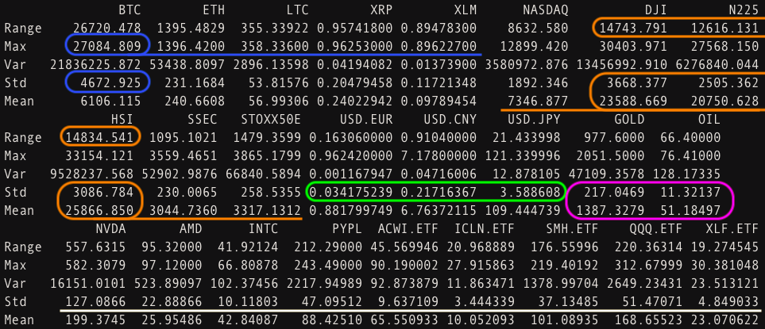</img>
**Main cryptocurrencies**:
Bitcoin (BTC) is the most valuable one as we can see from the max value, but it’s also the one with the
largest value, and also the most fluctuating one.

**Stock Market Indices**:
DowJones (DJI), Nikkei (N225), and Hang Seng (HSI), seem to have quite the same pattern in time, by
looking at their means, std and ranges. 

**FIAT currencies**:
They seem to be much more stable w.r.t. cryptocurrencies, as we can see from their std's.

--

### Plots: 

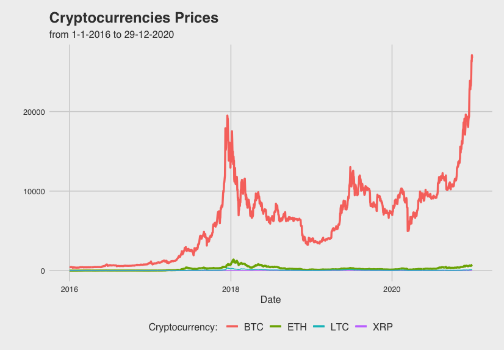
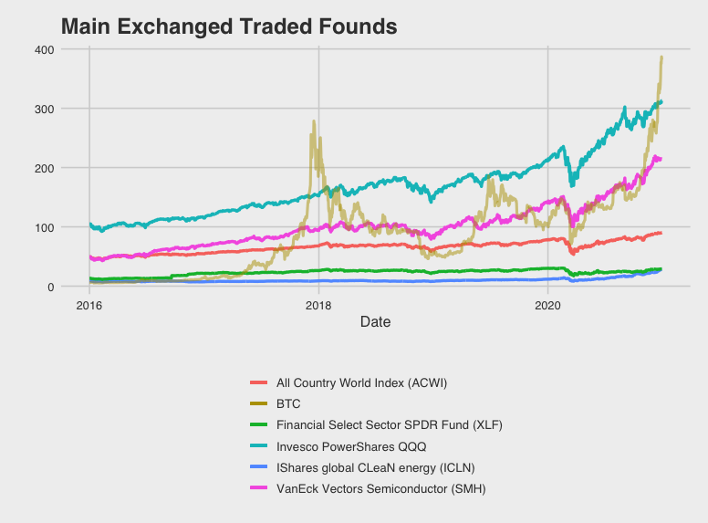
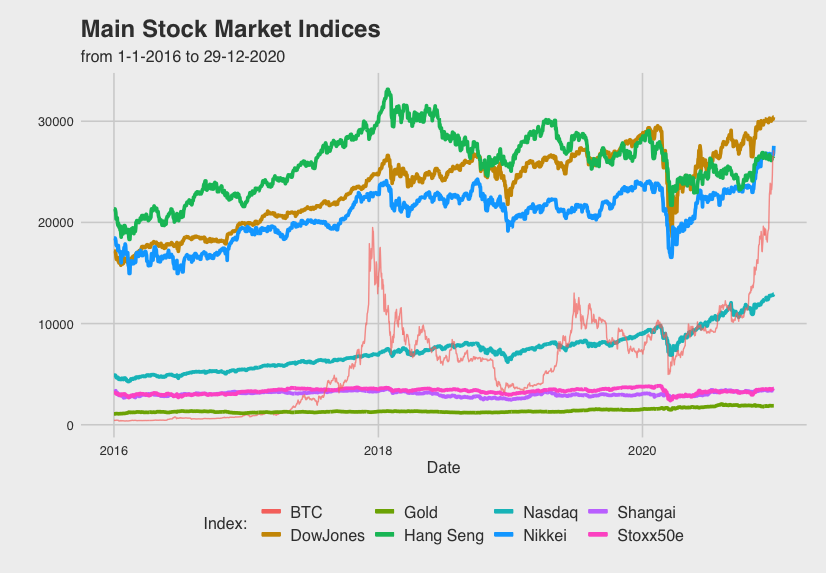
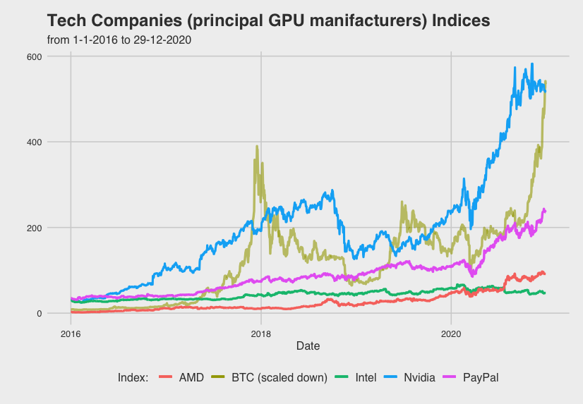

--

### Correlations:

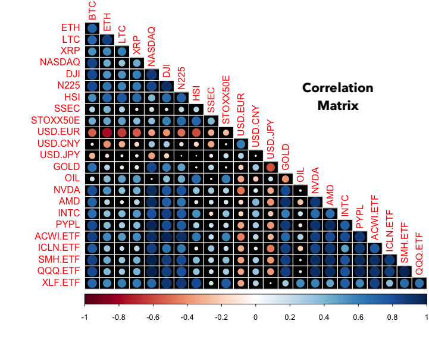

Cryptocurrencies are quite related to each other.
Something similar tends to happen also for Stock Market indices, and tech corporations indices.
That doesn’t happen for FIAT currencies.
Bitcoin seems to have a strong relation with stock markets, as well as either with Tech Corps and with ETFs.

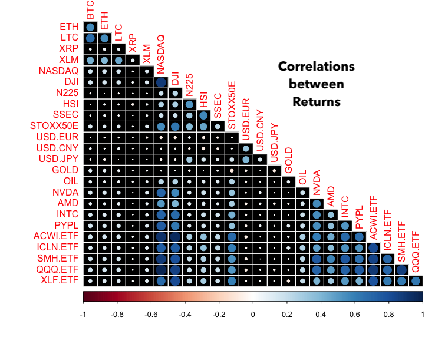

Correlations tend to disappear as we look at the returns.
- Some positive values among cryptocurrencies
- between American Stock Market indices and tech corporations’
and with respect to ETFs
- between Hang Seng and Nikkei.
- Among the ETFs
- between ETFs returns and Tech Companies

## Linear Models

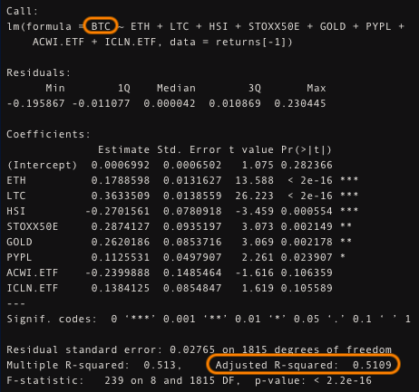

Trying to predict the returns of Bitcoin.
Ethereum and Litecoin are included in the model as significant.
The returns of the Hang Seng, GOLD and the STOXX50E index, are included.
Instead, the return of Paypal is less significant.
Surprisingly the ETFs have been thrown away.
Adjusted R2 is suggesting that this model is able to explain just the 51% of the total variance.

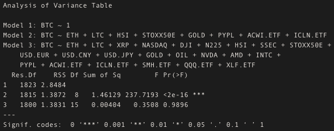

Looking at the ANOVA table, we can say that, with respect to the “null model” (fitting the mean), the introduction of the variables in the stepwise selected model is significant and we can reject the Null hypothesis that all these variables are null.
Instead, we cannot reject the null hypothesis with respect to the model including all the variables, hence all those variables that do not appear in the stepwise selected model are not significantly different from 0.

## Networking Analysis

### Simple Correlation

We can use networks to deeper understanding relations among features. The one we see below it’s made of simple correlations.
What we can see is that there’s a group of cryptocurrency related between each other, as well as a group of market indices highly related to each other.
Slightly more distant from this group, we find what can represent “asia”, i.e. Nikkei index, Hang Seng and the Shangaii Stock Exchange index. Finally we can also see a subgroup of variables representing the FIAT currency rate of exchange.

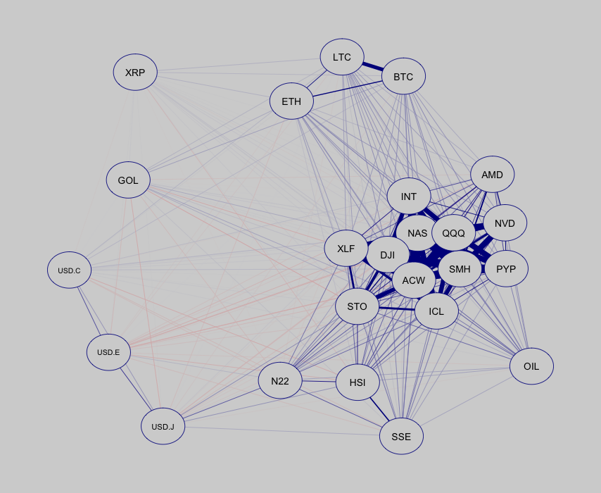

### Partial correlation 

Negative relations (the red ones) are much more evident now.
We can still recognize the group of cryptocurrencies, which are strongly linked together.
Instead, the links that were connecting stock “not asian” stock indices, are slightly more spread in the net.
Still evident the linking between the “asian” indices.
What’s new? It has been more highlighted the relation between the Nikkei index and the rate of exchange between USD and the Japanese Yuan. It’s also interesting to notice that the SMH ETF is highly linked with the Tech companies, such as Intel, Nvidia and AMD.
It seems that the cryptocurrencies are quite “isolated” with respect to the rest of the variables. 

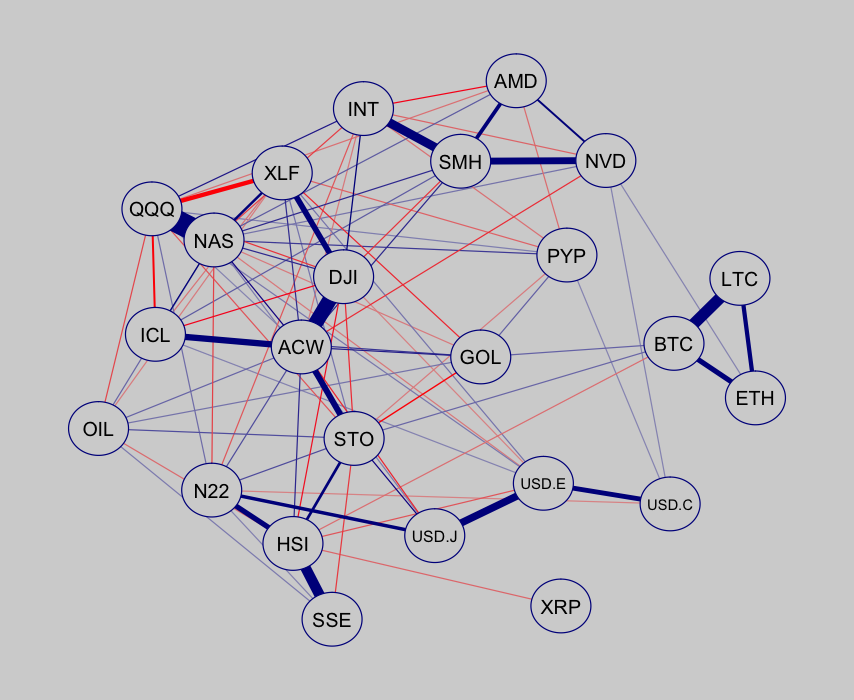

### Centrality Measures 

Let’s look at the centrality measures ...

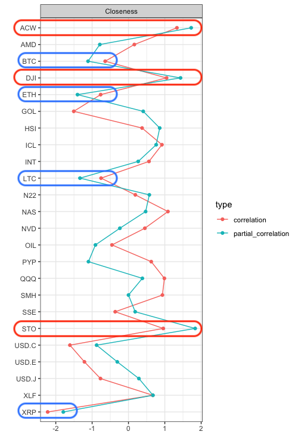

Cryptocurrencies are confirmed to be less central than other variables, and in particular Ripple (XRP) is the least central in the graph.
Among the most central variables we can list the ACWI etf, the DowJones index and the European STOXX50.

## K-Means Clustering Results 

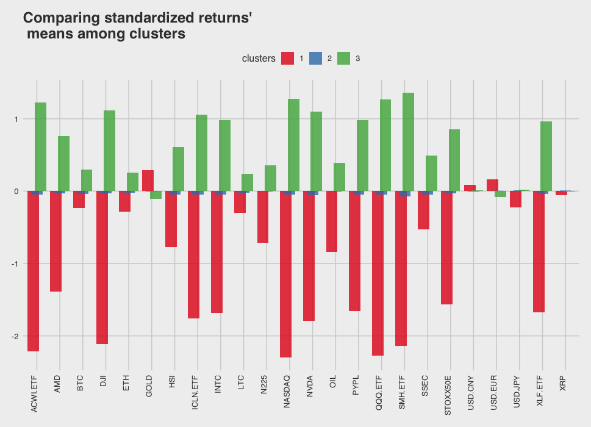
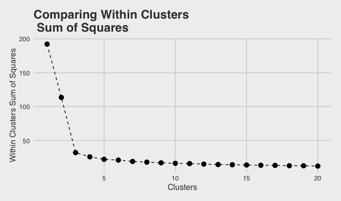

## Neural Networks

The “degrees of freedom” here stands in the choice of the number of layers, call it depth, and in the number of neurons per layer, called width.
The best architecture in terms of minimum validation RMSE, has been tested on a different split of the dataset, the test set.

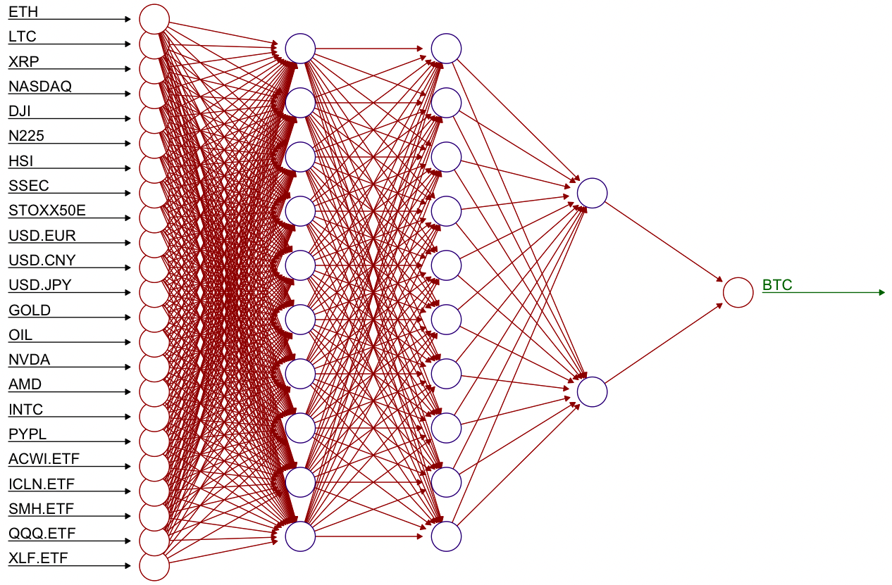

### Results in the Test Set 

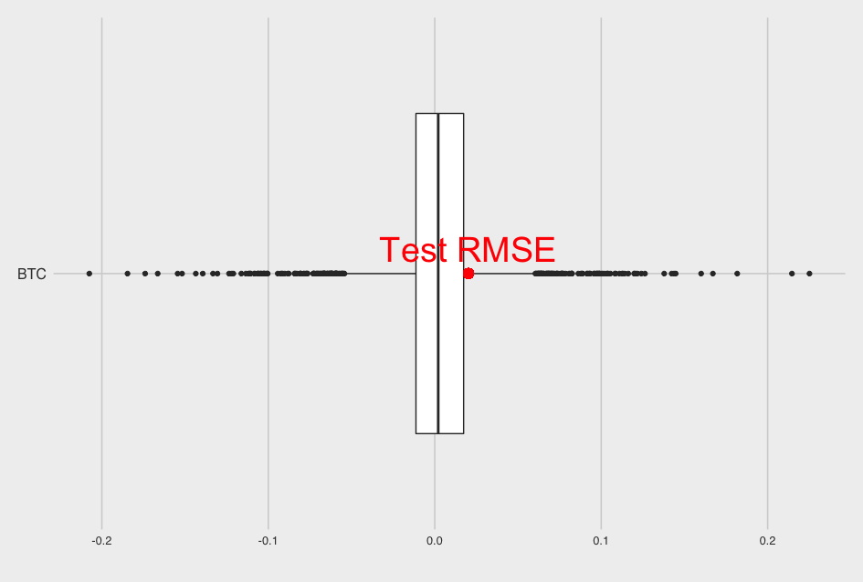

Performance is not very satisfying in this case:
On average the neural network makes an error which is slightly higher than the 3rd quantile value.

### Shapley Values

As in the case of linear models, not all the variables are actually useful in predicting BTC.

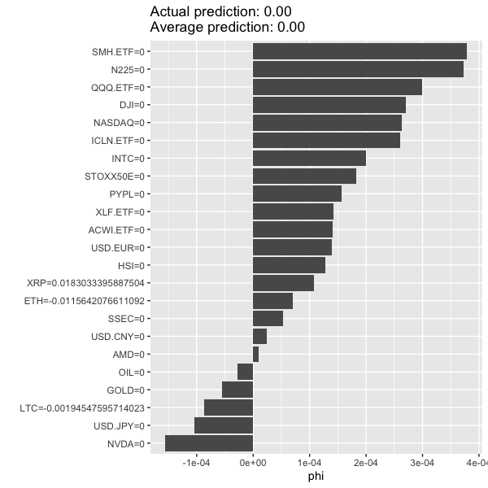

## Conclusion 

 - Bitcoin has shown the most irregular path compared to the ones of the most common indices, like
commodities, Nikkei, DowJones, and so on.
- OLS has shown, since the beginning, the difficulty of predicting the returns of Bitcoins.
- Network Analysis and Clustering have highlighted that not all the considered variables are actually important in terms of relationship both with cryptocurrencies and with the rest of them.
This has been partially validated by the Shapley Values analysis of the Neural Networks variables’ contributions.
- The number of cluster has been chosen with the elbow method, which is somehow subjective, but one can also choose that number by performing some statistical test, which is a more accurate way of proceeding.
- Neural Networks have shown some difficulties in predicting BTC with a test set of observation.
This could be partly fixed by performing some model selection on those variables that this analysis has demonstrated to have less influence in predicting BTC.

Anyway, poor performances could be partly explained by the following reasons...

In “Giudici, G., Milne, A., & Vinogradov, D. (2020). Cryptocurrencies: market analysis and perspectives. Journal of Industrial and Business Economics“, it has been suggested that:
***“exchange rates, commodity prices, or macroeconomic factors of traditional significance for other assets play little to none role for most cryptocurrencies”***
And also ...
***“Cryptocurrency prices may drop dramatically because of a revealed scam or
suspected hack”***.
In general, as we can see from the google trend of bitcoin related search terms, the price of BTC is highly sensitive to external events, both in negative (2018 case) and in positive sense (2020-early 2021)

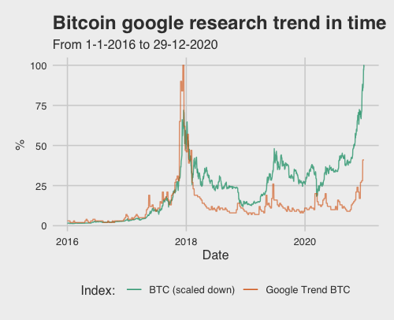

### What if we try to predict something more 'stable'?

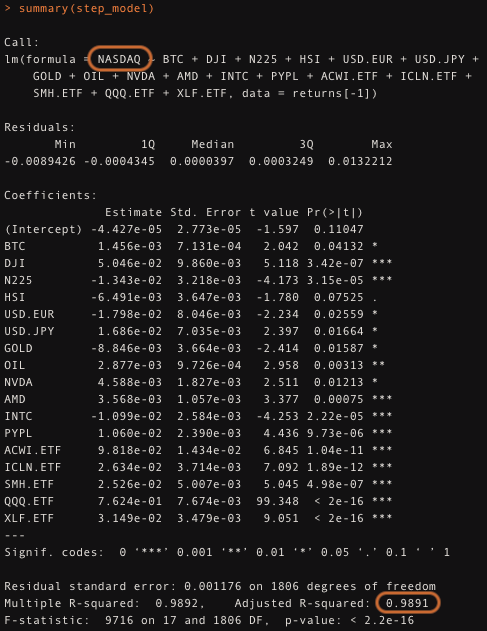

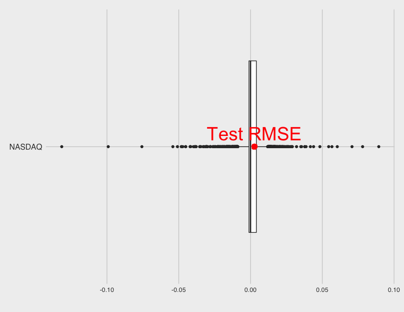

